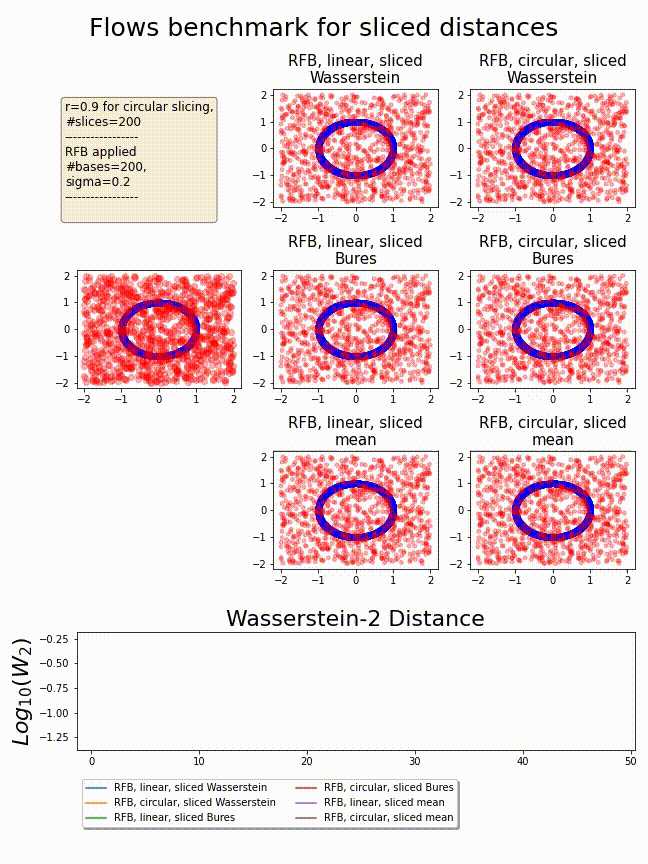

# Flows benchmark
## Reweighting Instances
### Sliced distances with Random Fourier Bases

### Max-sliced distances with Random Fourier Bases

### Distributional-sliced distances with Random Fourier Bases

